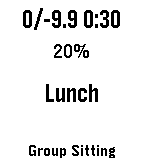

# Vipassana Watchface for Pebble



A minimalist Pebble watchface designed specifically for students and servers attending Vipassana meditation courses as taught by S.N. Goenka.

**Stay focused on the present moment while staying on schedule.**

## Overview

During a 10-day Vipassana course, students maintain noble silence and follow a strict meditation schedule. This watchface helps you:

- **Stay on schedule** without calendar distractions
- **Track progress** with a decimal countdown of remaining working time
- **Know what's next** at a glance
- **Maintain mindfulness** with minimal, distraction-free design

## Features

### Smart Time Display

- **Decimal countdown**: Shows precise remaining days in 18-hour "working day" format (excludes sleep time 22:00-04:00)
- **Format**: `X/-Y.Z H:MM`
  - `X` = Current course day (0-11)
  - `-Y.Z` = Remaining days with one decimal place (e.g., `-8.3` means 8.3 working days left)
  - `H:MM` = Time until next activity
- **Smart targets**: Counts down to noble silence end (Day 10, 10:10), then to course end (Day 11, 08:50)

### Activity Tracking

- **Current activity**: Large text showing what you're doing now (wraps if needed)
- **Next activity**: Shows what's coming up
- **Context-aware**: Different schedules for Students vs. Servers, and for different day types

### Essential Info

- **Battery percentage**: Clear, large display so you never run out during meditation
- **Clean layout**: All information visible at a glance
- **No distractions**: No calendar dates, no day-of-week, no animations

### Comprehensive Settings

Configure via your phone's Pebble app:

- Course start date (arrival day)
- Service period start date (if serving)
- Course type (10-day, 20-day, Satipatthana, etc.)
- Course role (Student or Server)
- Location numbers: Room, Pagoda Cell, Dining Hall, Cushion

## Display Layout

```
3/-6.5 0:15        ← Day 3 / 6.5 days left / 15 min to next
85%                ← Battery percentage
Meditation in      ← Current activity (wraps)
Room
Breakfast          ← Next activity
```

## Example Scenarios

**Day 0 (Arrival), before first meditation:**

```
0/-10.3 5:55
82%
Settling In
First Meditation
```

**Day 3, during group sitting:**

```
3/-6.5 0:15
78%
Group Sitting in
Dhamma Hall
Breakfast
```

**Day 9, evening discourse:**

```
9/-0.7 0:45
71%
Discourse in
Dhamma Hall
Tea & Rest
```

**Day 10, after noble silence ends:**

```
10/-0.8 2:30
68%
Metta Meditation
in Dhamma Hall
Questions
```

## Installation & Setup

### Installing from Rebble Appstore

1. Open the Pebble app on your phone
2. Go to **Watchfaces** → **+ Get Watchfaces**
3. Search for **"Vipassana"**
4. Tap **Add** to install

### Installing from .pbw File (Sideloading)

If you have the `.pbw` file:

1. **Enable Developer Mode**
   - Open the Pebble mobile app
   - Go to **Settings** → Select your watch
   - Enable **"Developer Connection"**

2. **Install via Pebble CLI** (requires [Pebble SDK](https://developer.rebble.io/developer.pebble.com/sdk/install/index.html))

   ```sh
   pebble install --cloudpebble
   ```

   Or directly from file:

   ```sh
   pebble install build/pebble-vipassana.pbw
   ```

3. **Or use the Pebble app**:
   - Transfer the `.pbw` file to your phone
   - Open it with the Pebble app
   - Tap **Install**

### Configuring Settings

After installation:

1. Open the Pebble app on your phone
2. Go to **Watchfaces** → Find **Vipassana** → Tap **Settings** (gear icon)
3. Configure your course details:

**Required Settings:**

- **Course Start Date & Time**: Set to arrival day at midnight (e.g., "2026-02-04 00:00")
- **Course Type**: Select your course type (10-day, 20-day, Satipatthana, etc.)
- **Course Role**: Student or Server

**Optional Settings:**

- **Service Start Date**: Only needed if you're serving after your course
- **Room Number**: Your accommodation room number
- **Pagoda Cell**: Your assigned meditation cell number
- **Dining Hall Number**: Your seating assignment
- **Dhamma Hall Cushion**: Your cushion number

**Important**: All dates/times should be set to midnight (00:00) in your local timezone. The watchface uses wall-clock time and handles timezone changes automatically.

### First Use

After configuring settings:

1. The watchface will display your current course day and countdown
2. If it shows "Course Not Started" or "Course Ended", verify your course start date is correct
3. Battery percentage displays in the center
4. Current and next activities appear below

## How the Countdown Works

The decimal countdown shows **working time remaining** until key milestones:

### Working Day Calculation

- **Working hours**: 04:00 to 22:00 (18 hours)
- **Sleep time**: 22:00 to 04:00 (6 hours, excluded from countdown)
- **One decimal place**: Precise to 1/10th of a working day (~1.8 hours)

### Countdown Targets

1. **Before noble silence ends**: Counts down to **Day 10, 10:10** (when Metta meditation ends and students may speak)
2. **After noble silence ends**: Counts down to **Day 11, 08:50** (bus departure / course end)

### Examples

- `-10.3` = 10.3 working days remaining (~185 working hours)
- `-6.5` = 6.5 working days remaining (~117 working hours)
- `-0.7` = 0.7 working days remaining (~12.6 working hours)
- `-0.1` = 0.1 working days remaining (~1.8 working hours)

This gives you a precise sense of progress through the course while excluding sleep time from the calculation.

## Supported Platforms

- **Pebble Classic** (Aplite)
- **Pebble Steel** (Aplite)
- **Pebble Time** (Basalt)
- **Pebble Time Steel** (Basalt)
- **Pebble Time Round** (Chalk)
- **Pebble 2** (Diorite)
- **Pebble Time 2** (Emery, unreleased prototype)

## Building from Source

### Quick Build

```sh
# Clone the repository
git clone https://github.com/zgypa/pebble-vipassana.git
cd pebble-vipassana

# Build for all platforms
./scripts/build.sh

# Install to emulator (Basalt)
./scripts/run-emulator.sh

# Or install to your watch
pebble install --cloudpebble
```

For detailed development instructions, see [docs/dev.md](docs/dev.md).

## Contributing

Contributions are welcome! Please feel free to submit issues or pull requests.

### Areas for Contribution

- Additional course types and schedules
- Localization (translations)
- UI refinements
- Bug fixes and testing

## License

This project is open source. See LICENSE file for details.

## Acknowledgments

- **S.N. Goenka** and the Vipassana tradition for teaching the technique
- **Rebble** for keeping Pebble alive
- **gotling/vipassana-pebble** - Original inspiration for this project
- All Vipassana students and servers who provided feedback

## Support & Contact

- **Issues**: [GitHub Issues](https://github.com/zgypa/pebble-vipassana/issues)
- **Questions**: Open an issue or discussion on GitHub
- **Dhamma**: Learn more about Vipassana at [dhamma.org](https://www.dhamma.org/)

## Changelog

### v0.3.0 (Current)

- Added decimal countdown with working day calculation (18-hour days)
- Smart target switching (noble silence end → course end)
- Added Dhamma Wheel icon
- Improved display format: `X/-Y.Z H:MM`

### v0.2.0

- Added comprehensive settings UI
- Support for multiple course types
- Student vs. Server schedules
- Location number tracking

### v0.1.0

- Initial release
- Basic day/time display
- Activity tracking

---

**May all beings be happy. May all beings be peaceful. May all beings be liberated.**

## Technical Details

### Timezone Handling

The watchface uses **local calendar dates** exclusively:

- All times are "wall clock time" (no UTC conversion)
- Course start "2026-02-04 00:00" means Feb 4 midnight in your current timezone
- Schedule times (14:30 meditation) are local time
- Works correctly through timezone changes and DST transitions
- Day boundaries are midnight local time

### Schedule Architecture

Course schedules are in `src/c/schedule.c`:

- **Separate timetables** for Students vs. Servers
- **Day types**: Arrival, Anapana, Transition, Vipassana, Metta, Departure
- **Course types**: 10-day, 20-day, Satipatthana, Old Student, Children's
- **Stored as minutes** since midnight (0-1439)

### Display Optimization

- **Text wrapping**: Activity names wrap across multiple lines as needed
- **Compact time**: No leading zeros (5:42 not 05:42)
- **Buffer sizes**: Carefully tuned to prevent truncation
- **Battery-efficient**: Updates only when needed

## Resources & Documentation

- 📖 [Architecture Documentation](docs/architecture.md) - Technical deep-dive
- 🛠 [Development Guide](docs/dev.md) - Build & development setup
- 🌐 [Rebble SDK Documentation](https://developer.rebble.io/sdk/) - Pebble SDK reference
- 🧘 [Dhamma.org](https://www.dhamma.org/) - Learn about Vipassana meditation
- 💡 [gotling/vipassana-pebble](https://github.com/gotling/vipassana-pebble) - Original inspiration
